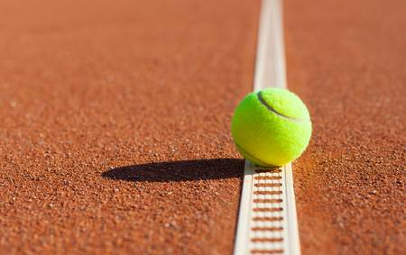
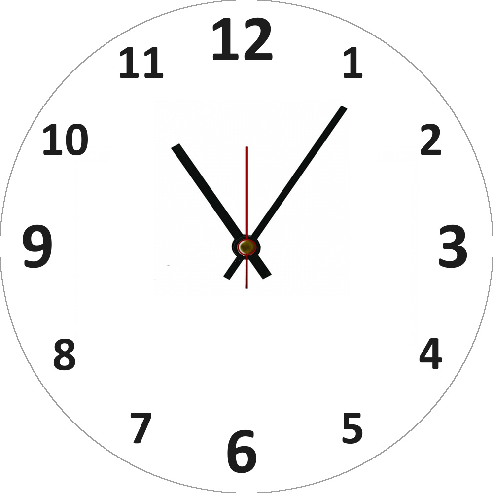

% Ficha didáctica
% Iniciación al tenis
% marzo 2019

# Descripción del curso

## Descripción del curso

{ height=250px }\

- Este minicurso está diseñado para servir de **introducción teórica** al tenis. Trata de ser una manera **amena y breve** de concnocer más de este apasionante mundo antes de ponerse a jugar.

# Características del curso

## Destinatarios

- Alumnos preferiblemente mayores de 14 años

## Objetivos didácticos

{ height=350px }\

## Objetivos didácticos

| **Contenido**                     | **Objetivos**                                                     |
| :-----:                           | :-----:                                                           |
| Historia del tenis                | Conocer brevemente la historia del tenis                          |
| Reglamento del tenis              | Conocer las reglas del tenis                                      |
| Material y equipamiento del tenis | Familiarizarse con el equipamiento necesario para practicar tenis |

## Duración del curso

{ height=350px }\

## Duración del curso

1. **Lectura y contenido del curso:** 

*5 horas*

2. **Trabajo personal:**

*5 horas*

## Conocimiento previo

{ height=350px }\

## Conocimiento previo

- No es necesario ningún conocimiento previo específico

